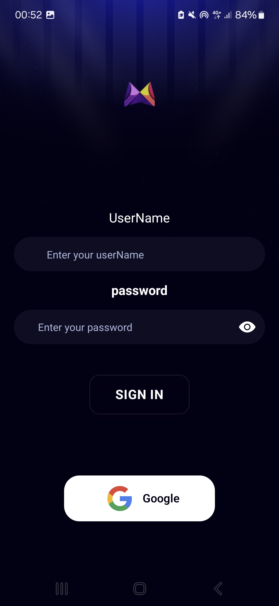
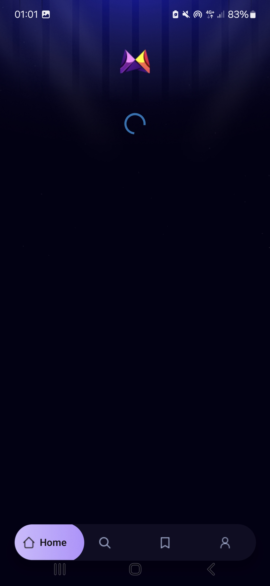
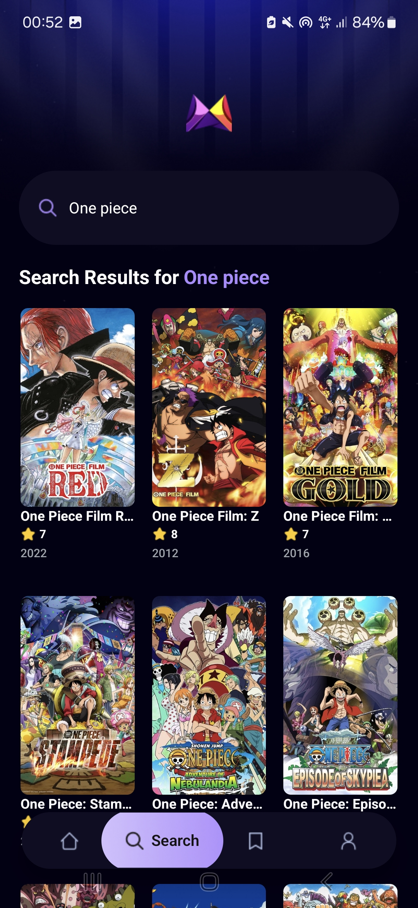
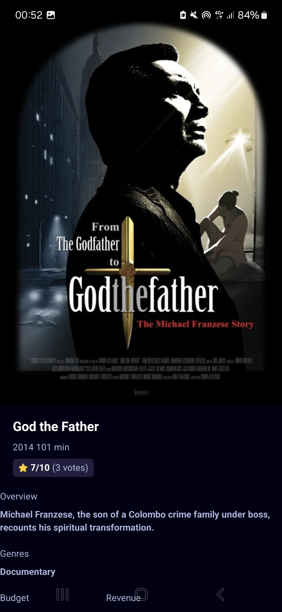
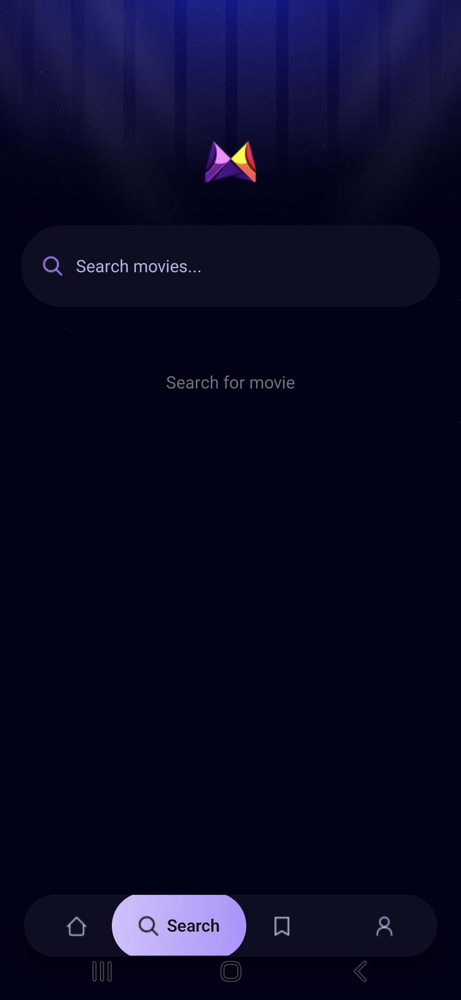
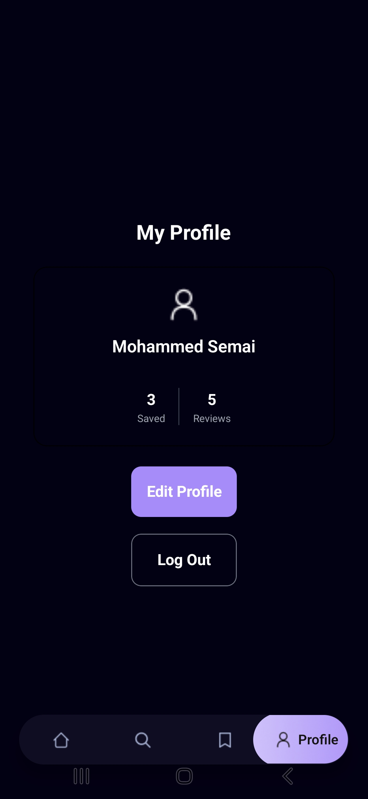

# MovieApp
Version: 1.0.0

MovieApp is a modern mobile application built with React Native and Expo that allows users to discover trending movies, search for their favorites, and manage a personal watchlist. It leverages the TMDB API for movie data and Appwrite for backend services like tracking search trends.

## Table of Contents
- [Project Structure](#project-structure)
- [Technologies](#technologies)
- [Installation](#installation)
- [Environment Variables](#environment-variables)
- [Running the Project](#running-the-project)
- [Linting & Formatting](#linting--formatting)
- [Features](#features)
- [License](#license)

## Project Structure
```
app/
├── (auth)/          # Authentication screens 
├── (tabs)/          # Main tab navigation (Home, Search, Saved, Profile)
├── movie/           # Movie details screens
├── _layout.tsx      # Root layout configuration
└── global.css       # Global styles
assets/              # Static assets (fonts, icons, images)
components/          # Reusable UI components (MovieCard, SearchBar, etc.)
constants/           # App constants (icons, images, theme colors)
services/            # API integrations (TMDB, Appwrite)
types/               # TypeScript definitions
```

## Technologies
- **Frontend:** React Native, Expo, TypeScript
- **Styling:** NativeWind (Tailwind CSS)
- **Navigation:** Expo Router
- **Backend Services:** Appwrite (Database & Storage)
- **Data Source:** TMDB API (The Movie Database)
- **Linting & Formatting:** ESLint, Prettier

## Installation

1. Clone the repository
```bash
git clone https://github.com/Semai-Mohamed/MovieApp
cd MovieApp
```

2. Install dependencies
```bash
npm install
```

## Environment Variables
Create a `.env` file in the root directory and add the following variables:

| Variable | Description |
|----------|-------------|
| `EXPO_PUBLIC_MOVIE_API_KEY` | API Key for The Movie Database (TMDB) |
| `EXPO_PUBLIC_APPWRITE_ENDPOINT` | Appwrite API Endpoint |
| `EXPO_PUBLIC_APPWRITE_PROJECT_ID` | Appwrite Project ID |
| `EXPO_PUBLIC_APPWRITE_DATABASE_ID` | Appwrite Database ID |
| `EXPO_PUBLIC_APPWRITE_COLLECTION_ID` | Appwrite Collection ID for tracking trends |

## Running the Project

| Environment | Command | Description |
|-------------|---------|-------------|
| Development | `npx expo start` | Start the development server |
| Android | `npm run android` | Run on Android emulator/device |
| iOS | `npm run ios` | Run on iOS simulator/device |
| Web | `npm run web` | Run in web browser |

## Linting & Formatting

| Task | Command | Description |
|------|---------|-------------|
| Linting | `npm run lint` | Check for code issues using ESLint |
| Formatting | `npm run format` | Format code using Prettier |

## Features

### Discovery
- **Trending Movies:** View a list of currently popular movies.
- **Search:** Real-time search functionality powered by TMDB.
- **Details:** Comprehensive movie details including rating, release date, and overview.

### User Experience
- **Watchlist:** Save movies to your personal list for later viewing.
- **Profile:** Manage user settings and preferences.
- **Responsive Design:** Optimized for both iOS and Android devices.

### Backend Integration
- **Search Analytics:** Tracks popular search terms using Appwrite to improve recommendations.
- **Real-time Updates:** Dynamic content fetching.

## License
This project is licensed under the MIT License.

---
*Screenshots*
<div style="display: flex; flex-direction: row; gap: 10px;">
  
  
   
  
   >    
</div>
<div style="display: flex; flex-direction: row; gap: 10px; margin-top: 10px;">

 
  
   </div>

<div style="display: flex; flex-direction: row; gap: 10px; margin-top: 10px;">

  

</div>